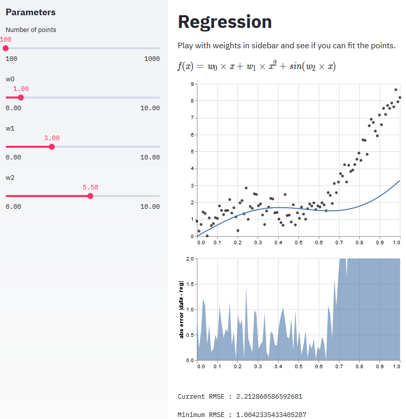

# Streamlit app on regression

Streamlit app for building a demo for regression to a somewhat arbitrary function. It's like [regression-ipywidgets-viz](https://github.com/andfanilo/regression-ipywidgets-viz) but with Streamlit ;)



## Install

```
conda create -n regression-streamlit-viz python=3.7
conda activate regression-streamlit-viz
pip install -r requirements.txt
```

To regenerate `requirements.txt`, run `pip-compile requirements.in`

## Run

```
streamlit run app.py
```
